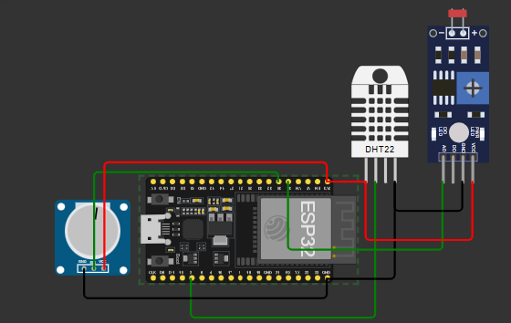
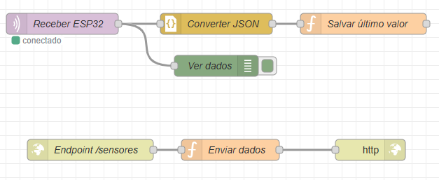

# 🌐 NextWork – Global Solution 2 | FIAP 2025

### Tema:  
**O Futuro do Trabalho**

---
## 👥 Integrantes do Grupo

| Nome                             | RM     |
| -------------------------------- | ------ |
| **Anna Clara Ruggeri da Silva**  | 565553 |
| **Giovana Bernardino Carnevali** | 566196 |
| **Henrique Vicente Vicente**     | 564116 |

---

## 🚀 Sobre o Projeto

O **NextWork** é uma plataforma web colaborativa desenvolvida para **empresas e organizações**, com o objetivo de **conectar profissionais, competências e propósito** através da tecnologia.

Inspirado no tema da **Global Solution 2 da FIAP**, o projeto propõe uma simulação de rede profissional moderna e funcional, que representa o futuro do trabalho — mais **conectado, inteligente e sustentável**.

Além da interface web, o NextWork inclui um **protótipo IoT com ESP32**, que monitora **luminosidade, ruído e temperatura do ambiente corporativo**, transmitindo os dados em tempo real via **Node-RED e MQTT**.

---

## 💡 Problema

Em um cenário onde o trabalho híbrido e as novas formas de colaboração digital se tornam cada vez mais presentes, as empresas enfrentam desafios como:

- Dificuldade em conectar talentos de forma inteligente;  
- Falta de integração entre pessoas e tecnologia;  
- Ambientes de trabalho pouco adaptáveis ao bem-estar e produtividade.  

---

## 🌱 Solução Proposta

O **NextWork** une **tecnologia web e IoT** para criar um ecossistema corporativo inteligente:

- 💻 **Plataforma Web**: Desenvolvida com **React** e **Tailwind CSS**, lista perfis profissionais fictícios com filtros, busca, dark mode e modal de detalhes.  
- 🤖 **Protótipo IoT (ESP32)**: Capta dados de **luminosidade**, **ruído** e **temperatura**, enviando-os via **MQTT** para o **Node-RED**, onde são tratados e expostos por um **endpoint HTTP**.  
- 🧠 **Integração Inteligente**: A aplicação web consome os dados via **fetch()**, atualizando a interface e gerando feedbacks sobre o ambiente corporativo — desde “ambiente tranquilo” até “ambiente barulhento”.  

---

## ⚙️ Tecnologias Utilizadas

| Camada | Tecnologias |
|--------|--------------|
| **Frontend Web** | React.js, Tailwind CSS, Fetch API |
| **IoT** | ESP32, DHT22, LDR, Potenciômetro |
| **Backend** | Node-RED, MQTT, HTTP Endpoint |
| **Protocolo de Comunicação** | MQTT (Broker: HiveMQ) |
| **Simulação** | Wokwi IoT Simulator |

---


## 🔌 Funcionamento IoT (ESP32 + Node-RED)

### 🔹 Fluxo de Comunicação

1. O **ESP32** lê dados do **LDR**, **Potenciômetro (simulando captando sons)** e **DHT22**.  
2. As informações são enviadas via **MQTT** para o tópico `esp32/sensores`.  
3. O **Node-RED** recebe, converte o JSON e armazena os últimos valores.  
4. O **endpoint HTTP** `/sensores` disponibiliza esses dados para a interface web.  
5. O **NextWork (React)** consome o endpoint com `fetch()` e exibe os valores na tela.

---

### 🧠 Explicação Técnica – MQTT e HTTP Endpoint

#### 🔸 MQTT (Message Queuing Telemetry Transport)
- É um **protocolo leve de comunicação** ideal para IoT.  
- O ESP32 publica mensagens no **broker público HiveMQ**.  
- O Node-RED age como **cliente assinante (subscriber)**, recebendo as medições.  

#### 🔸 Endpoint HTTP
- Criado no Node-RED para **expor os dados mais recentes** de forma acessível via HTTP.  
- A aplicação web faz **requisições fetch()** para `http://localhost:1880/sensores`.  
- Caso o ESP32 esteja desligado, o endpoint retorna `null` e a interface exibe a mensagem *“Dados não captados pelos sensores”*.

---

## 🧭 Instruções de Uso

### 1️⃣ Clone o repositório
```bash
git clone https://github.com/GS2025-2/nextWork.git
cd netWork
````

### 2️⃣ Instale as dependências

```bash
npm install
```

### 3️⃣ Execute o projeto React

```bash
npm run dev
```

### 4️⃣ Configure o Node-RED

* Importe o fluxo disponível em `node-red/fluxo.json`
* Verifique o endpoint HTTP em:
  👉 **[http://localhost:1880/sensores](http://localhost:1880/sensores)**

### 5️⃣ Execute a simulação do ESP32

🔗 [Abrir simulação no Wokwi](https://wokwi.com/projects/447328787500644353)

---

## 🖼️ Imagens do Projeto

### 🔸 Protótipo ESP32



### 🔸 Fluxo Node-RED



---

## 🎬 Vídeo Explicativo

📺 [Assista no YouTube](https://youtu.be/fhS0_3X5JWU)


---

## 🏁 Conclusão

O **NextWork** representa o futuro do trabalho sob a ótica da tecnologia e do bem-estar.
Com a integração entre **inteligência de dados, conectividade IoT e interfaces modernas**, o projeto reforça o papel da **FIAP** na formação de profissionais preparados para o **mundo corporativo 4.0**, onde pessoas e tecnologia caminham lado a lado.

---

✨ *Projeto desenvolvido para Global Solution 2 – FIAP 2025.*

```


